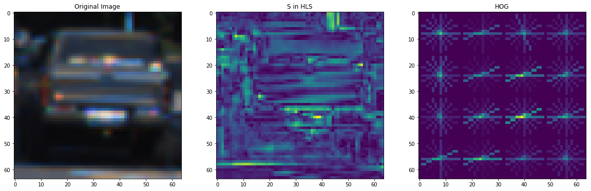
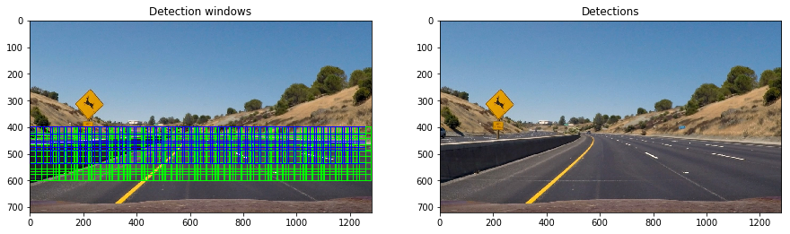
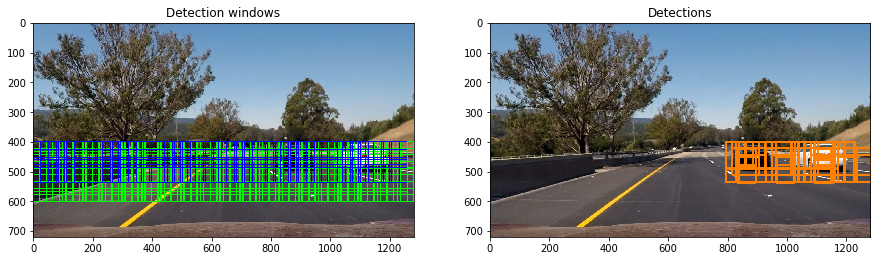
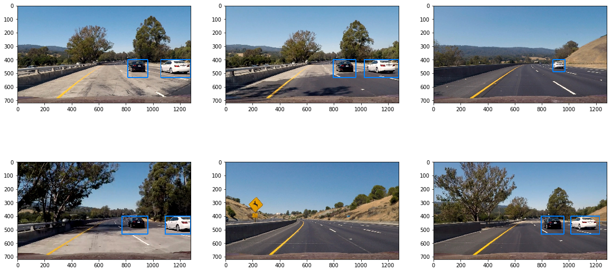
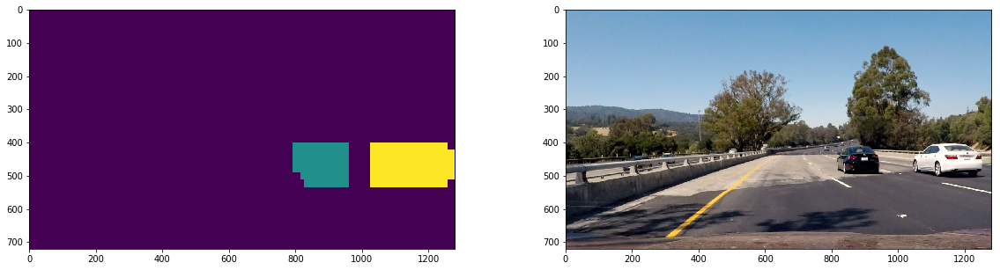


## Vehicle Detection and Tracking

---

### Histogram of Oriented Gradients (HOG)

#### The Dataset
The dataset used to train the support vector machine classifier is somewhat diverse and is very close to equal in terms of class-wise distribution meaning that the car vs non-car bias will very low on a well tuned classifier.

#### 1. HOG Feature Extraction
I first loaded in the car and non-car dataset in memory and picked a sample car image.

The hog feature extraction is implemented in the *get_hog_feature* function which is used in the *feature_extraction* function that generates the feature vectors used to classify cars in sliding windows.

After exploring many different combinations of feature extractions, this one gave me the best result in detections.

Here is an example using the `YCrCb` color space and HOG parameters of `orientations=9`, `pixels_per_cell=(8, 8)` and `cells_per_block=(2, 2)`:

#### 2. Final choice of HOG parameters.

I tweaked and tried various parameters and, under the advice of the forums, switched to YCrCb colour space, until I got to a satisfying result out of my SVM's score on the test dataset. 

#### 3. Classifier Training

The SVM training step can be found in the first cell of the *Dataset Splitting and Classifier Training* section. 

I first split my dataset along a 85-15% distribution for training and testing. Then I generated the appropriate ground truth labels in an array and shuffled the data randomly. 

My SVM reported a test accuracy of 99.4%.

### Sliding Window Search

#### 1. Finding the right scales

I used the test images in order to tweak my window's size, min-max height and overlap so that cars in the image would be in as many bounding boxes as possible while reducing the amount of false positives.

Here is the sliding window search working on a picture with and without cars:

#### 2. Pipeline examples

I ended up searching on three scales as it would allow me the detect cars further away in lane and closer to me much better.

By adding the combination system which I talk about next, we can see that the pipeline seems to work very well for detecting cars in still images:

---

### Video Implementation

Here's a [link to my video result](./output_project_video.mp4)

####  Filtering and Combination

To filter and combine detections, I create a heatmap where each window detection adds one point to its bounding area. This allows me to combine the multitude of boxes by just turning the nonzero heatmap areas into boxes of their own.

By adding up the last 20 heatmap frames and thresholding how high a value needs to be for counting as a detection, I filtered out a good amount of the intermittent false positives.

By using the scipy.ndimage.measurements.label() method, we can combine the difference boxes and draw a rectangle around them, here is the labeled output matrix next to the original image:

---

### Discussion

#### Room for improvements

- I am rerunning my feature extraction many times over the same area instead of applying it to the whole image. Sadly since this requires a lot of code change and I am out of time, I cannot implement it now, but this is a big to do

- Use a deep learning approach by harvesting the power of fully convolutional neural networks and their implementations like RCNN, YOLO, SSDs. This would allow for a much more robust architecture.

- Use a larger more diverse car dataset

- Attempt to use optical flow type systems for tracking once the detection has happened in order to increase performance and allow for real-time feasibility 
